# AWS-static-webhosting
This project was enabled me understand the process of hosting a static website both on an EC2 instance server and on S3 bucket.The project also requires that the same website was be routed using Route53 through a domain name which I purchased prior to this project. This was to eanble access to the website through domain name as agianst IP address.  
There are two sections to this project

- Hosting the static website through EC2 server 
- Hosting the website through S3 bucket
### A. Static Website Hosting through EC2 instance 

1. Provision a Linux EC2 instance, in this project I made use of Ubuntu
2. Updates was done 
 
2. Install Apache Web server Manually

3. Download the static website zipped file from a repo or a known site (e.g tooplate.com)
4. Upload zipped static website file to the web server using Secure Copy Protocol

5. Unzip the file and copy the content to the path below on your Web Server;  Path => /var/www/html( this is the webserver pathused for hosting). You may need to install unzip first 

6. Restart the apache server

6. Test that you can access the website from the Public IP address

7. Configure Route 53 with your Domain name if you have one.
    - Create an hosted zone
    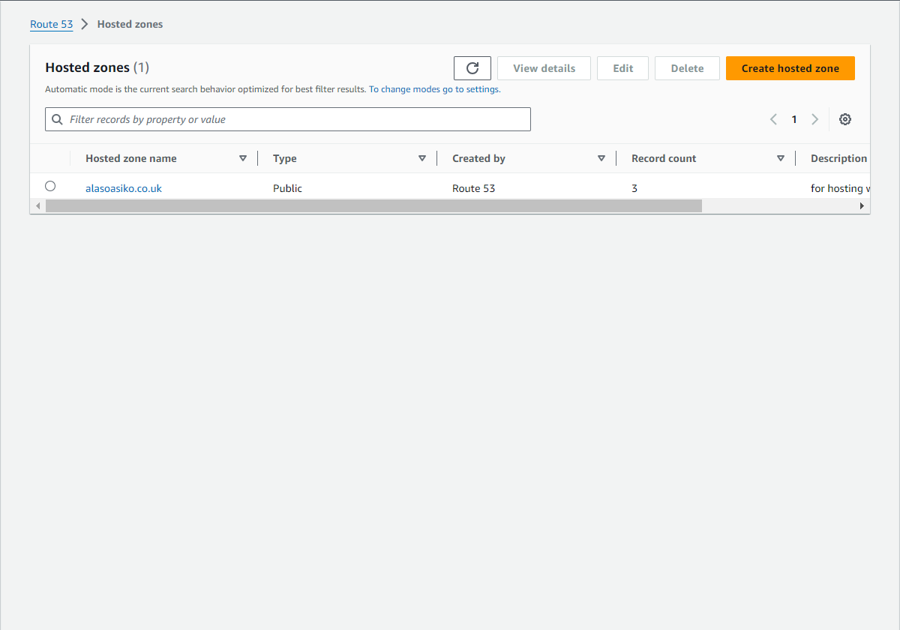
    - create a record, and in this case, use the A record
    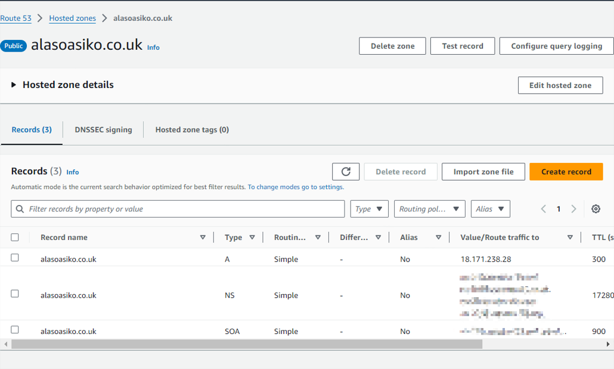 
8. Test that you can access the site with the domain name  
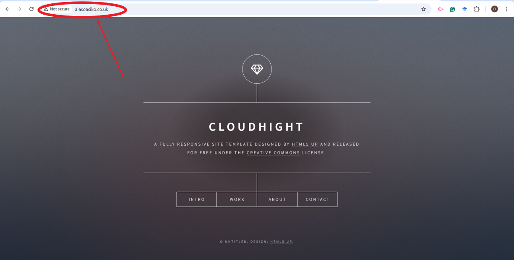

### B. Static Website Hosting through S3 Bucket

Use an S3 bucket to host a static website, although we are still using the same files for the website but here, the difference is that the website is hosted on an S3 bucket and there will be no need for IP address as we are not using any server for this section

1. Create an S3 bucket to host the static site, advisably, the name of the bucket should be the same as your domain name.
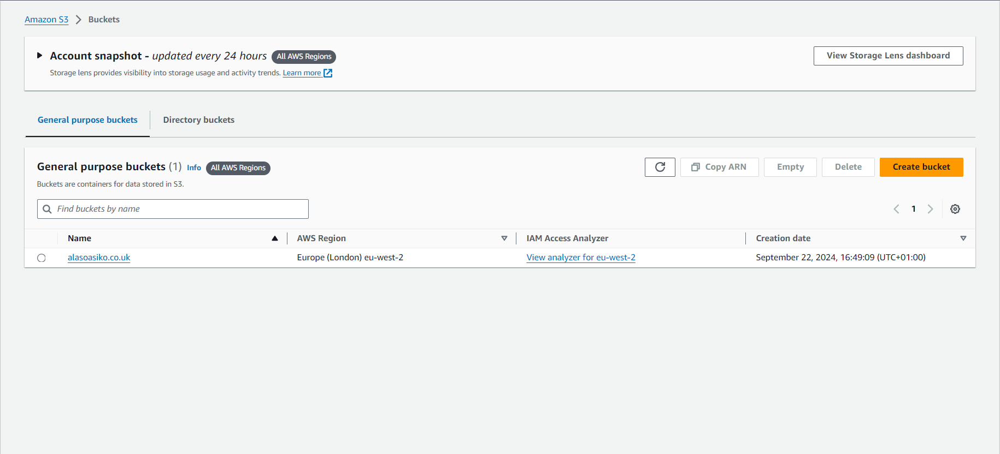
2. Create a folder for server logging, call it serverLog, this is to enable tracking of all logs in the bucket
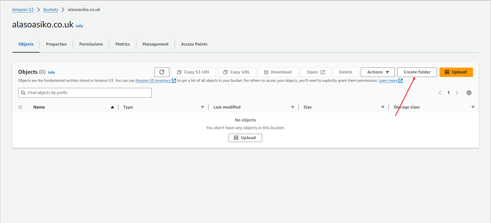
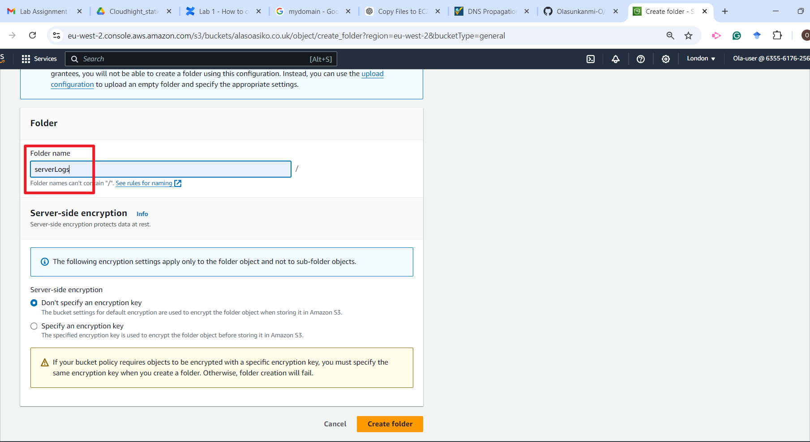
3. Under properties tab, edit server access logging 
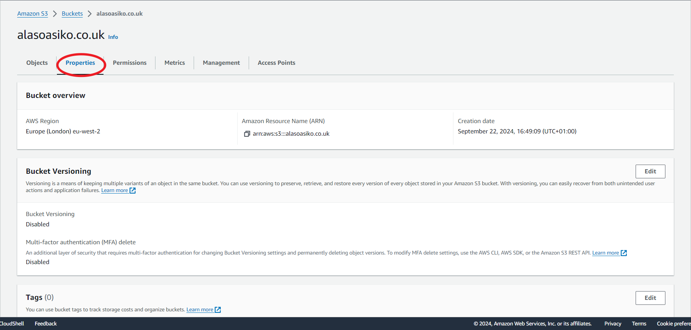
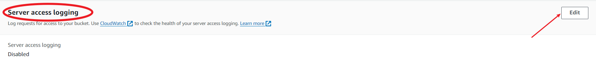
4. Enable access log and choose the path to the new folder created
! 
5. Upload the websites files 

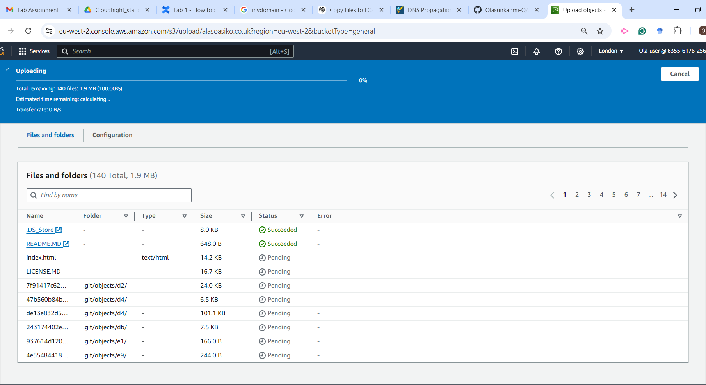
6. Back to properties tab, scroll down to Static website hosting, and enable 
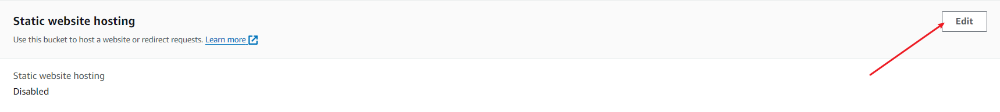
7. Under the permission tab, untick the 'blockall public access'. This is to ensure that the bucket is accessible since we will be using it to launch a website
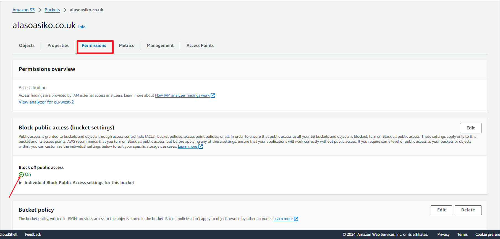
8. Edit the bucket policy to allow 'GetObject' and all objects should be geatable from the bucket
! 
9. Back to the properties tab, scroll down to the static website hosting, copy the Bucket website endpoint and paste on your browser to verify the website
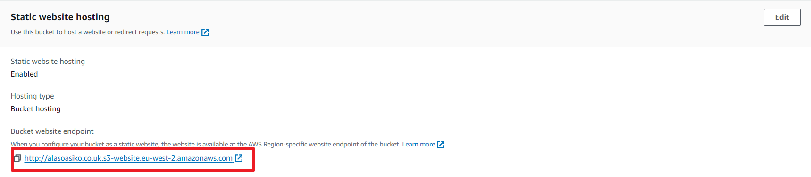
10. Verify that the website is live.

11. Under services on the AWS console, search for Route53, under the hosted zone, pick your domain name and click on create record
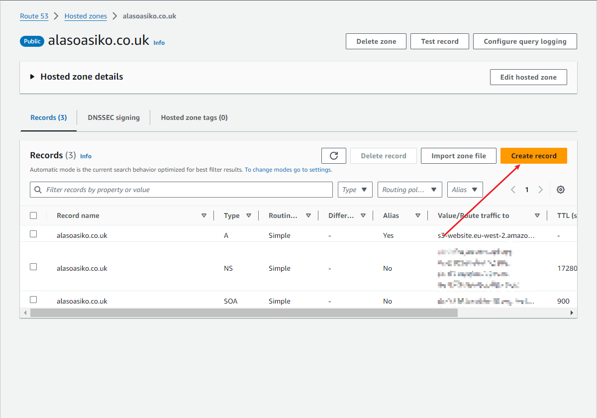
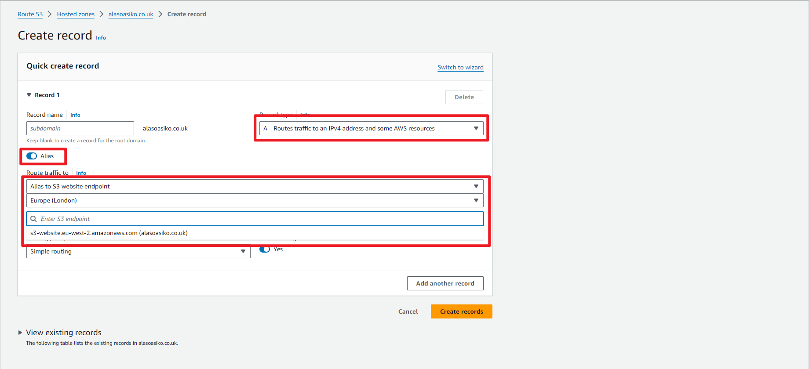
12 Access the website using your domain name.
 

